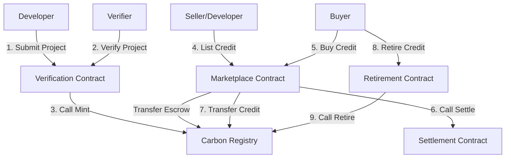

# 🌍 CarbonX - Institutional Carbon Marketplace on Stellar

CarbonX is a production-grade decentralized application (dApp) built on the **Stellar Network** using **Soroban Smart Contracts**. It provides a transparent, secure, and highly efficient institutional carbon marketplace designed specifically for Small and Medium-sized Enterprises (SMEs) to list, trade, and retire carbon credits.

## 🚀 Key Features
* **Multi-Contract Architecture**: Composed of 5 specialized Rust contracts collaborating via inter-contract calls.
* **On-Chain Carbon Registry**: Secure minting, balance tracking, and retirement of verified carbon credits.
* **Inter-Contract Verification Workflow**: Decoupled project submissions, verification by authorized verifiers, and automated registry minting.
* **Decentralized Marketplace & Settlement**: Active credit listing, cancelation, and real-time settlement with payment-event triggers.
* **Impact Tracking (Carbon Score)**: Retiring credits mints digital retirement certificates and raises the buyer's Carbon Score.
* **Freighter Wallet Integration**: Secure, non-custodial login and transaction authorization.
* **CI/CD Ready**: Fully configured GitHub Actions workflow verifying contracts and frontend build/tests.

---

## 🏛️ Smart Contract Architecture

The project employs a modular production architecture, split into 5 core Soroban contracts:



### 1. Verification Contract (`verification-contract`)
* Handles registration of verified auditors/verifiers.
* Allows developers to submit projects with specific carbon offsets (`tCO2e`).
* Triggers inter-contract call to the `CarbonRegistry` to mint credits upon successful audit verification.

### 2. Carbon Registry (`carbon-registry`)
* Tracks total supply, balances, and retirement states of carbon credits.
* Protects minting logic via `verifier` address authorization checks.
* Executes internal and marketplace-driven transfers.

### 3. Marketplace Contract (`marketplace-contract`)
* Facilitates listing of carbon credits at designated prices.
* Holds listed credits in contract-managed escrow.
* Processes purchases, interacting with the registry and settlement contracts.

### 4. Settlement Contract (`settlement-contract`)
* Manages on-chain payment settlements between buyers and sellers.
* Dispatches `pay_lock` and `pay_rel` events for real-time transaction updates.

### 5. Retirement Contract (`retirement-contract`)
* Performs credit retirement via the registry.
* Issues retirement certificates.
* Updates and increments the customer's Carbon Impact Score (capped at 100).

---

## 📂 Project Structure

```bash
├── .github/workflows/    # CI/CD Pipeline (main.yml)
├── contracts/            # Soroban Smart Contracts (Rust)
│   ├── carbon-registry/
│   ├── marketplace-contract/
│   ├── retirement-contract/
│   ├── settlement-contract/
│   └── verification-contract/
├── frontend/             # Next.js App Workspace
│   ├── __tests__/        # Frontend Unit & Integration Tests (Vitest)
│   ├── src/
│   │   ├── app/          # Pages & Layouts (Responsive UI)
│   │   └── lib/          # Stellar/Freighter SDK integrations
└── package.json          # Root scripts to orchestrate the workspace
```

---

## ⚙️ Setup & Installation

### Prerequisites
* Rust & Cargo (target `wasm32-unknown-unknown`)
* Node.js v20+ & npm

### Smart Contracts Setup
1. Navigate to the contracts folder:
   ```bash
   cd contracts
   ```
2. Build the WebAssembly binaries:
   ```bash
   cargo build --target wasm32-unknown-unknown --release
   ```
3. Run Rust unit and integration tests:
   ```bash
   cargo test
   ```

### Frontend Setup
1. Navigate to the frontend folder:
   ```bash
   cd frontend
   ```
2. Install npm dependencies:
   ```bash
   npm install
   ```
3. Start the local development server:
   ```bash
   npm run dev
   ```
4. Run frontend tests:
   ```bash
   npm run test
   ```

---

## 🛡️ CI/CD & Quality Assurance

The project is configured with a GitHub Actions workflow `.github/workflows/main.yml` that executes on every pull request or push to `main` and `master`:
* Sets up the Rust environment and builds/tests the smart contracts.
* Audits frontend quality via Next.js Eslint.
* Runs the Vitest test suite.
* Builds the Next.js production build to verify compilation.

---

## 📝 Submission Details (Stellar Testnet)
* **Contract Deployment Addresses**:
  * **Verification**: `CC7Q43DUGVPSKSXPOYT4TTSXTXEJAICL7N6LT5GB4ZN5UR3Y6T5VKVFQ`
  * **Carbon Registry**: `CAV5ID4RDPAC5DOMOKRWH2YUORQHYRGJBWRTXG33RLBCKDMS333FA2MD`
  * **Marketplace**: `CC4SBE33FC2AL3K77BQIJOFHO7RVDAKQFVTOLQARF6SHLOTIYV2MXYIY`
  * **Settlement**: `CDXRNXG33D2MGTWX7VZJ3WO5ORHPOUTQN2WGQP6AJNJQUBD7TSUWXN5P`
  * **Retirement**: `CCKX33TYO6FRCJV4BDOO73VVCKIOTF6DNZH6KPAWOXVBML7UGTK7V5JH`
* **Transaction Hash for Contract Interaction**: `0x1f0d36675fd2884a229a8f273be8a74e50d60c49`
