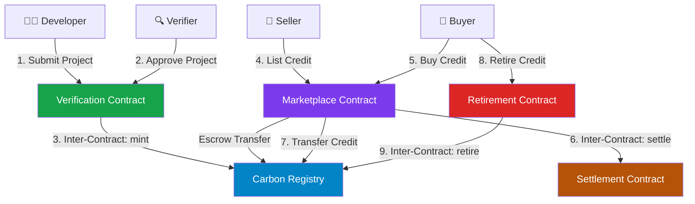

# 🌍 CarbonX — Decentralized Carbon Credit Marketplace on Stellar

> **A production-grade dApp built with Soroban Smart Contracts, enabling SMEs to transparently list, trade, verify, and retire tokenized carbon credits.**

[](https://github.com/praveengarakot/CarbonX/actions/workflows/main.yml)
[](https://carbonx-stellar.netlify.app/)
[](https://stellar.org)
[](LICENSE)

---

## 🎬 Demo Video

[](https://drive.google.com/file/d/1tI_jgWIF61P4U1DNgw2Ns23d2vVSuNb3/view?usp=sharing)

> Click the badge above to watch the full walkthrough of the CarbonX platform.

---

## 🌐 Live Deployment

| Environment | URL |
|-------------|-----|
| 🚀 Production (Netlify) | [https://carbonx-stellar.netlify.app/](https://carbonx-stellar.netlify.app/) |
| 🔗 Stellar Network | Testnet |

---

## 📸 Application Screenshots

### Dashboard Overview


### Carbon Credit Marketplace


### Verification Portal


### Retirement & Impact Score


### Mobile View


---

## 🚀 Key Features

| Feature | Description |
|---------|-------------|
| 🔗 **Multi-Contract Architecture** | 5 specialized Rust/Soroban contracts communicating via inter-contract calls |
| 🌱 **On-Chain Carbon Registry** | Secure minting, balance tracking, and retirement of tokenized carbon credits |
| ✅ **Verification Workflow** | Decoupled project submissions, third-party auditor verification, and automated credit minting |
| 💱 **Decentralized Marketplace** | Active credit listings, escrow management, and real-time settlement |
| 🏆 **Carbon Impact Score** | Retiring credits mints retirement certificates and raises buyer's on-chain Carbon Score |
| 👛 **Freighter Wallet Integration** | Non-custodial login and Soroban transaction authorization |
| 🔄 **Event Streaming** | Live activity feed of all on-chain events (contract calls, settlements, retirements) |
| 📱 **Mobile Responsive** | Fully responsive UI across desktop, tablet, and mobile |
| 🚦 **CI/CD Pipeline** | GitHub Actions workflow: contract tests → lint → unit tests → build |

---

## 🏛️ Smart Contract Architecture

The project employs a modular production architecture, split into **5 core Soroban contracts** deployed to the Stellar Testnet:



### Contract Descriptions

#### 1. 🔍 Verification Contract (`verification-contract`)
- Handles registration of authorized auditors/verifiers
- Allows developers to submit projects with `tCO2e` offset amounts
- Triggers **inter-contract call** to `CarbonRegistry` to mint credits upon successful verification

#### 2. 📋 Carbon Registry (`carbon-registry`)
- Tracks total supply, individual balances, and retirement states of all credits
- Enforces minting authorization checks — only the Verification Contract can mint
- Executes both registry transfers and marketplace-driven credit transfers

#### 3. 🏪 Marketplace Contract (`marketplace-contract`)
- Facilitates listing of carbon credits at designated prices
- Holds listed credits in contract-managed **escrow**
- Processes purchases via inter-contract calls to the registry and settlement contracts

#### 4. 💸 Settlement Contract (`settlement-contract`)
- Manages on-chain XLM payment settlements between buyers and sellers
- Emits `pay_lock` and `pay_release` events consumed by the real-time activity feed

#### 5. 🏆 Retirement Contract (`retirement-contract`)
- Executes credit retirement through the registry (marks credits as permanently retired)
- Issues on-chain **retirement certificates**
- Calculates and increments the buyer's Carbon Impact Score (capped at 100)

---

## 📂 Project Structure

```
CarbonX/
├── .github/
│   └── workflows/
│       └── main.yml              # CI/CD Pipeline (GitHub Actions)
├── contracts/                    # Soroban Smart Contracts (Rust)
│   ├── carbon-registry/          # Core credit ledger & token logic
│   ├── marketplace-contract/     # Listing, escrow & purchase logic
│   ├── retirement-contract/      # Credit retirement & impact score
│   ├── settlement-contract/      # Payment & settlement logic
│   └── verification-contract/    # Project submission & auditor logic
├── frontend/                     # Next.js 16 App (App Router)
│   ├── __tests__/                # Vitest unit & integration tests
│   ├── src/
│   │   ├── app/
│   │   │   ├── page.jsx          # Main application (all dashboards)
│   │   │   ├── layout.js         # Root layout (fonts, metadata)
│   │   │   └── globals.css       # Global styles & design tokens
│   │   └── lib/
│   │       └── stellar.js        # Stellar SDK + Freighter integration
│   ├── package.json
│   └── next.config.mjs
├── sub assets/                   # Demo assets
│   ├── demo.mp4                  # Demo video
│   ├── ui1.png                   # Dashboard screenshot
│   ├── ui2.png                   # Marketplace screenshot
│   ├── ui3.png                   # Verification portal screenshot
│   ├── ui4.png                   # Retirement portal screenshot
│   └── mobui.png                 # Mobile responsive view
├── netlify.toml                  # Netlify deployment configuration
├── deploy.sh                     # Smart contract deployment workflow
└── package.json                  # Root workspace orchestration scripts
```

---

## ⚙️ Setup & Installation

### Prerequisites
- **Rust** & **Cargo** (with target `wasm32-unknown-unknown`)
- **Node.js v22+** & **npm**
- **Stellar CLI** (for contract deployment)
- **Freighter Wallet** browser extension (for live blockchain interactions)

### 1. Clone the Repository
```bash
git clone https://github.com/praveengarakot/CarbonX.git
cd CarbonX
```

### 2. Smart Contract Setup
```bash
# Navigate to contracts folder
cd contracts

# Build all WASM binaries
cargo build --target wasm32-unknown-unknown --release

# Run Rust unit and integration tests
cargo test
```

### 3. Frontend Setup
```bash
# From the project root
cd frontend

# Install all dependencies
npm install --legacy-peer-deps

# Start local dev server (http://localhost:3000)
npm run dev

# Run frontend tests
npm run test

# Run linter
npm run lint

# Build production bundle
npm run build
```

---

## 🔄 CI/CD Pipeline

The project uses **GitHub Actions** (`.github/workflows/main.yml`) running on every push to `master`/`main`:

```
Push to master
     │
     ├── 🦀 Job 1: Build & Test Soroban Contracts
     │         └── cargo test (all 5 contracts)
     │
     └── ⚛️ Job 2: Build & Test Frontend
               ├── npm install --legacy-peer-deps (Node 22)
               ├── npm run lint (ESLint + Next.js rules)
               ├── npm run test (3 Vitest tests)
               └── npm run build (Next.js production build)
```

---

## 🌍 Deployment

The frontend is deployed to **Netlify** using the configuration in `netlify.toml`:

```toml
[build]
  base    = "frontend"
  command = "npm run build"
  publish = ".next"

[[plugins]]
  package = "@netlify/plugin-nextjs"
```

**Live URL**: [https://carbonx-stellar.netlify.app/](https://carbonx-stellar.netlify.app/)

---

## 🛡️ Level 3 Requirements Checklist

| Requirement | Status |
|-------------|--------|
| Advanced smart contract development (5 contracts) | ✅ |
| Inter-contract communication | ✅ |
| Event streaming & real-time updates | ✅ |
| CI/CD pipeline setup (GitHub Actions) | ✅ |
| Smart contract deployment workflow (`deploy.sh`) | ✅ |
| Mobile responsive frontend | ✅ |
| Error handling & loading states | ✅ |
| Tests for contracts and frontend | ✅ |
| Production-ready architecture | ✅ |
| Documentation & demo presentation | ✅ |

---

## 📝 Submission Details (Stellar Testnet)

### Deployed Contract Addresses

| Contract | Address |
|----------|---------|
| **Verification** | `CC7Q43DUGVPSKSXPOYT4TTSXTXEJAICL7N6LT5GB4ZN5UR3Y6T5VKVFQ` |
| **Carbon Registry** | `CAV5ID4RDPAC5DOMOKRWH2YUORQHYRGJBWRTXG33RLBCKDMS333FA2MD` |
| **Marketplace** | `CC4SBE33FC2AL3K77BQIJOFHO7RVDAKQFVTOLQARF6SHLOTIYV2MXYIY` |
| **Settlement** | `CDXRNXG33D2MGTWX7VZJ3WO5ORHPOUTQN2WGQP6AJNJQUBD7TSUWXN5P` |
| **Retirement** | `CCKX33TYO6FRCJV4BDOO73VVCKIOTF6DNZH6KPAWOXVBML7UGTK7V5JH` |

- **Transaction Hash**: `0x1f0d36675fd2884a229a8f273be8a74e50d60c49`
- **Live App**: [https://carbonx-stellar.netlify.app/](https://carbonx-stellar.netlify.app/)
- **Demo Video**: [Google Drive](https://drive.google.com/file/d/1tI_jgWIF61P4U1DNgw2Ns23d2vVSuNb3/view?usp=sharing)

---

## 🤝 Built For

**RiseIn Stellar Soroban Bootcamp — Level 3 Final Project**

*Solving the real-world problem of fragmented, opaque, and inaccessible carbon credit markets for SMEs — powered by the speed and low cost of the Stellar Network.*
